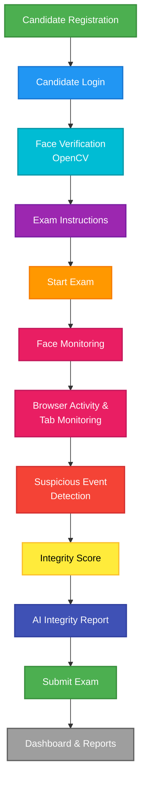

# Online Exam Monitoring & Integrity Analytics Platform

This project implements an online exam monitoring and integrity analytics system.

## Project Workflow Flowchart

```mermaid
graph TD
    A[Candidate Registration] --> B[Candidate Login]
    B --> C[Face Verification <br/> OpenCV]
    C --> D[Exam Instructions]
    D --> E[Start Exam]
    E --> F[Face Monitoring]
    F --> G[Browser Activity & <br/> Tab Monitoring]
    G --> H[Suspicious Event <br/> Detection]
    H --> I[Integrity Score]
    I --> J[AI Integrity Report]
    J --> K[Submit Exam]
    K --> L[Dashboard & Reports]

    style A fill:#4CAF50,stroke:#388E3C,stroke-width:2px,color:#fff
    style B fill:#2196F3,stroke:#1976D2,stroke-width:2px,color:#fff
    style C fill:#00BCD4,stroke:#0097A7,stroke-width:2px,color:#fff
    style D fill:#9C27B0,stroke:#7B1FA2,stroke-width:2px,color:#fff
    style E fill:#FF9800,stroke:#F57C00,stroke-width:2px,color:#fff
    style F fill:#E91E63,stroke:#C2185B,stroke-width:2px,color:#fff
    style G fill:#E91E63,stroke:#C2185B,stroke-width:2px,color:#fff
    style H fill:#f44336,stroke:#d32f2f,stroke-width:2px,color:#fff
    style I fill:#FFEB3B,stroke:#FBC02D,stroke-width:2px,color:#000
    style J fill:#3F51B5,stroke:#303F9F,stroke-width:2px,color:#fff
    style K fill:#4CAF50,stroke:#388E3C,stroke-width:2px,color:#fff
    style L fill:#9E9E9E,stroke:#616161,stroke-width:2px,color:#fff
```
